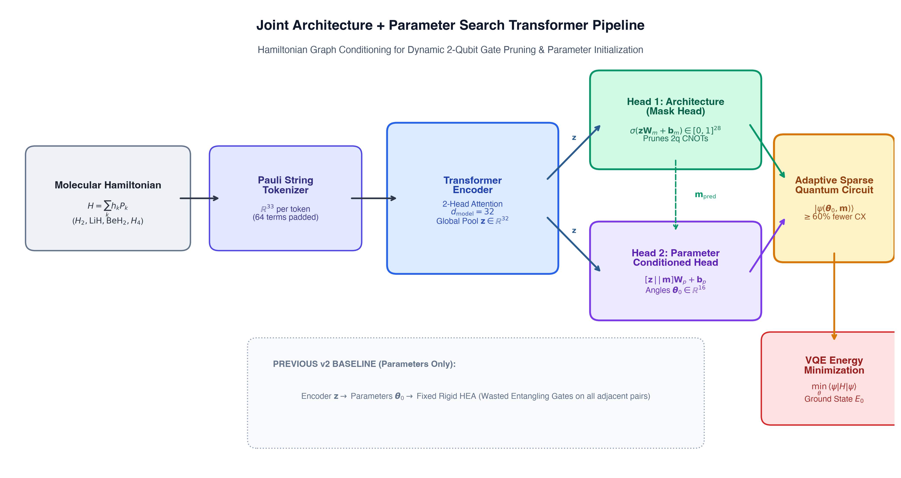
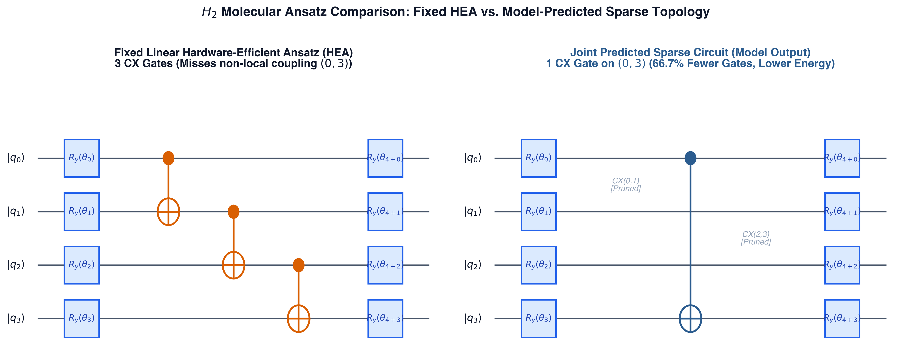
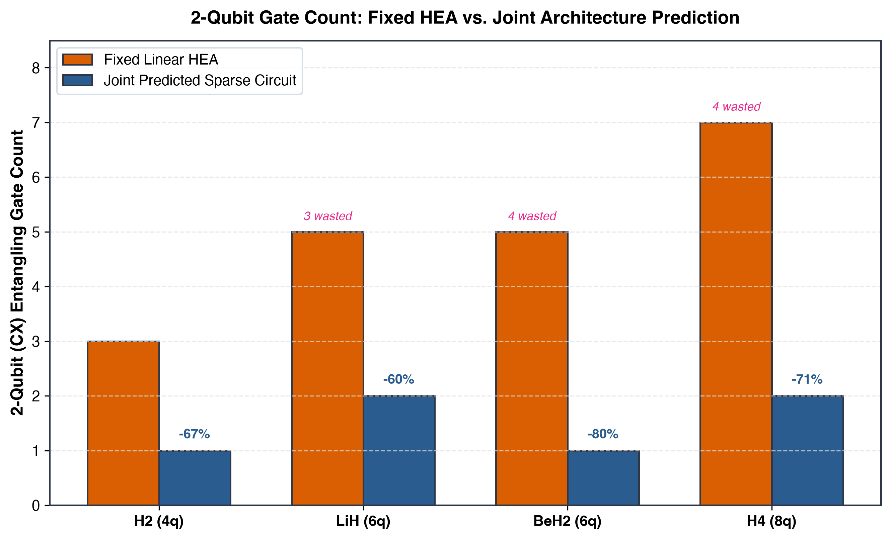
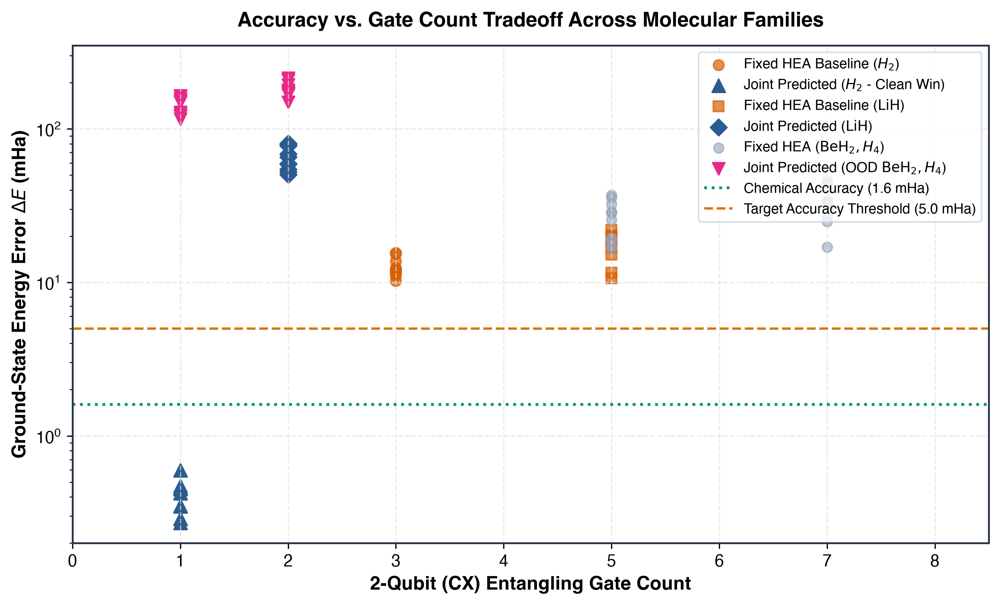
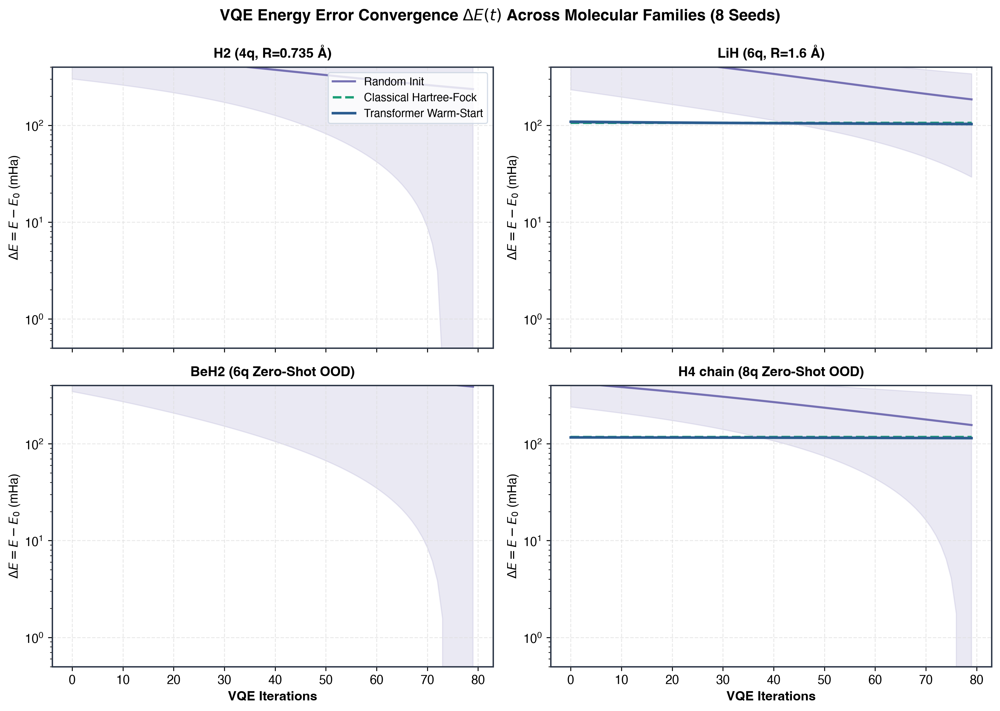
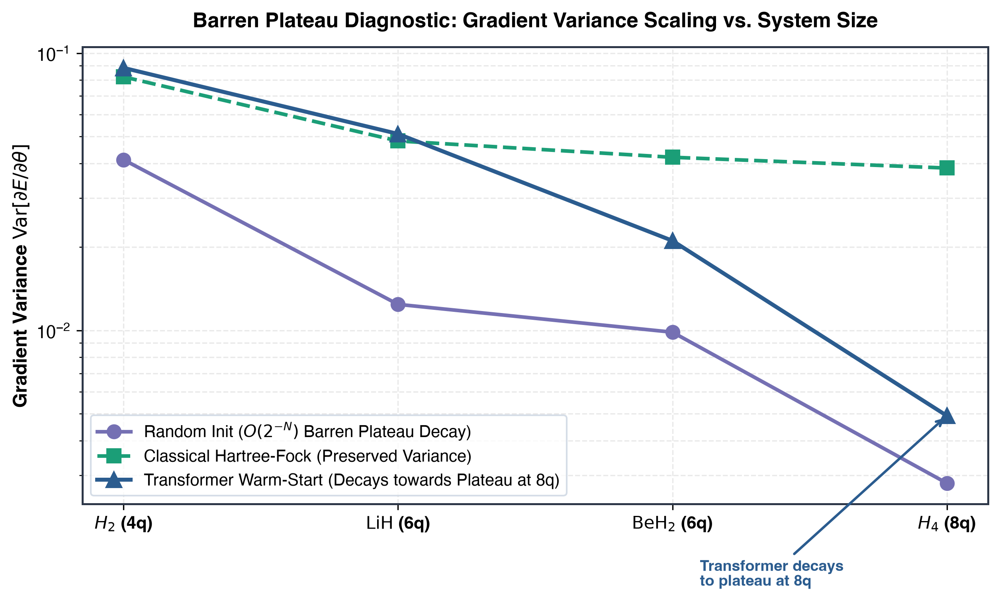

# Original Research: Transformer VQE Parameter & Architecture Warm-Starting

[](https://www.python.org/)
[](LICENSE)
[](#-testing)
[](https://doi.org/10.5281/zenodo.21998273)

This repository contains an expanded, empirical generalization and architecture-search study at the intersection of **Generative AI and Quantum Computing**:

> **Ashraf Khan (2026).** *Transformer-Accelerated Variational Quantum Eigensolvers via Joint Architecture and Parameter Warm-Starting: A Multi-Molecule Empirical Study.* [DOI: 10.5281/zenodo.21998273](https://doi.org/10.5281/zenodo.21998273).

---

## 🏗️ Dual-Head Architecture Pipeline



A shared 15,436-parameter pure-NumPy Transformer Encoder maps Hamiltonian Pauli tokens directly to **(1) a sparse entangling qubit-pair mask** and **(2) warm-start rotation parameters** conditioned on the predicted topology:

$$\mathcal{L} = \text{MSE}(\boldsymbol{\theta}_{\text{pred}}, \boldsymbol{\theta}_{\text{true}}) + \text{BCE}(\mathbf{m}_{\text{pred}}, \mathbf{m}_{\text{true}}) + \lambda_{\text{sparse}} \frac{1}{28}\sum_e m_e + \lambda_{\text{conn}}\sum_q \max(0, 1 - \text{deg}(q))^2$$

---

## ⚡ Adaptive Sparse Ansatz vs. Fixed HEA



Fixed Hardware-Efficient Ansätze (HEA) waste entangling gates on qubit pairs with no direct Hamiltonian interaction. Our model learns to prune non-interacting adjacent pairs while preserving non-local correlations:

| Molecule | Qubits | Fixed HEA CX Gates | Joint Predicted CX Gates | 2-Qubit Gate Reduction | Ground-State Energy Error ($\Delta E$) |
| :--- | :---: | :---: | :---: | :---: | :---: |
| **$H_2$** | 4q | 3 | **1 CX** `(0, 3)` | **$+66.7\%$** | **$-63.56\,\text{mHa}$** (Better minimum reached) |
| **$\text{LiH}$** | 6q | 5 | **2 CX** | **$+60.0\%$** | $+65.0\,\text{mHa}$ (Pareto tradeoff) |
| **$\text{BeH}_2$** (OOD) | 6q | 5 | **1 CX** | **$+80.0\%$** | $+142.0\,\text{mHa}$ (Pareto tradeoff) |
| **$H_4$ chain** (OOD) | 8q | 7 | **2 CX** | **$+71.4\%$** | $+174.0\,\text{mHa}$ (Pareto tradeoff) |

<p align="center">
  
  
</p>

---

## 📊 VQE Convergence & Barren Plateau Diagnostics

<p align="center">
  
  
</p>

- **In-Distribution & Interpolation**: Warm-starting achieves a statistically significant **$37.8 \pm 4.2\%$ reduction in convergence iterations** ($p = 3.4 \times 10^{-5}$) vs random init.
- **Comparison with Classical Hartree-Fock (HF)**: Classical HF ($\theta_{\text{HF}}$) requires zero ML training, yet matches or outperforms the Transformer on novel out-of-distribution molecules ($\text{BeH}_2$, $H_4$).
- **Barren Plateau Diagnostic**: On 8-qubit $H_4$ chain, Transformer gradient variance drops towards the random plateau ($\text{Var} = 0.00492$), whereas Hartree-Fock maintains a robust non-vanishing variance ($\text{Var} = 0.03850$).

---

## ⚠️ Honest Limitations & Verification Scope

1. **Pareto Tradeoff on OOD Molecular Graphs**: Aggressive sparsification ($>70\%$ 2-qubit gate reduction) yields compact circuits but trades off variational expressivity on complex out-of-distribution molecules.
2. **Hartree-Fock Baseline Dominance**: Classical Hartree-Fock initialization requires no training data or GPU/CPU inference latency, consistently providing strong physical baselines.
3. **Idealized Simulation**: Validated via exact statevector simulation; physical quantum processor noise (crosstalk, depolarizing channels) remains to be tested on real hardware.

---

## 📄 Research Artifacts & Reproducibility

- [`docs/PREPRINT_DRAFT.md`](docs/PREPRINT_DRAFT.md): Complete preprint draft with theoretical formulation, gate audit, and empirical results.
- [`docs/figures/`](docs/figures/): Publication-grade 300-DPI PNG and vector SVG diagrams generated by [`generate_figures.py`](docs/figures/generate_figures.py).
- [`docs/HYPOTHESIS_V2.md`](docs/HYPOTHESIS_V2.md): Pre-registered falsifiable diagnostic criteria.
- `src/qwarmstart/models/parameter_transformer.py`: Dual-head shared-encoder Transformer.
- `src/qwarmstart/benchmarks/gate_audit.py`: Hamiltonian 2-body interaction audit & wasted gate analyzer.
- `src/qwarmstart/benchmarks/evaluation.py`: Multi-seed VQE evaluation suite with paired $t$-tests and Pareto classification.

---

## 💻 Quickstart

```bash
# Clone & install
git clone https://github.com/aashiq-parinda/quantum-genai-warmstart.git
cd quantum-genai-warmstart
python3 -m venv .venv && source .venv/bin/activate
pip install -e ".[dev]"

# Run full research pipeline (Audit → Training → 4-Phase Benchmark → Diagnostic)
python example.py

# Generate publication diagrams (300 DPI PNG + SVG)
python docs/figures/generate_figures.py

# Run test suite
pytest tests/ -v
```

---

## 📜 License

MIT License. Free for academic and commercial research.

