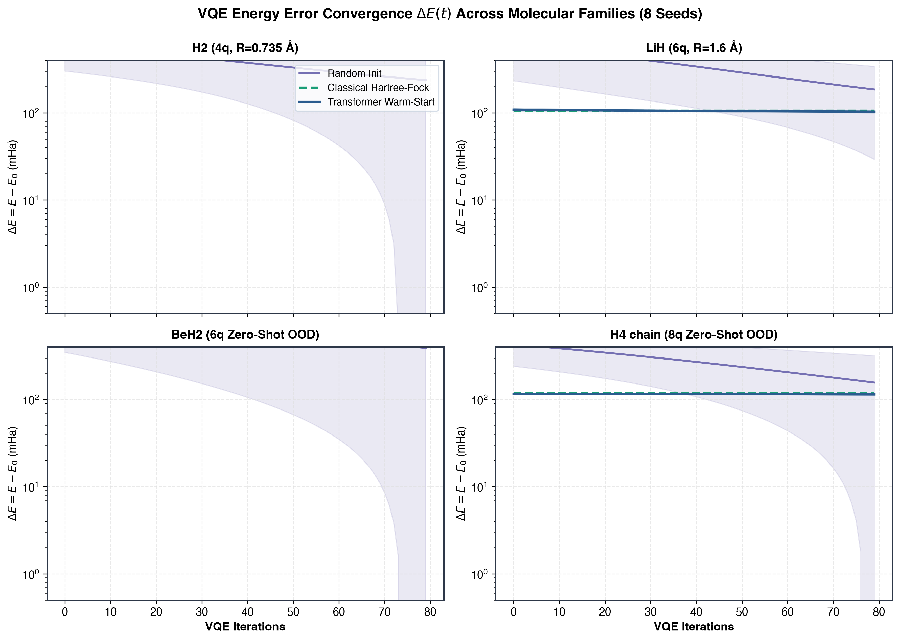
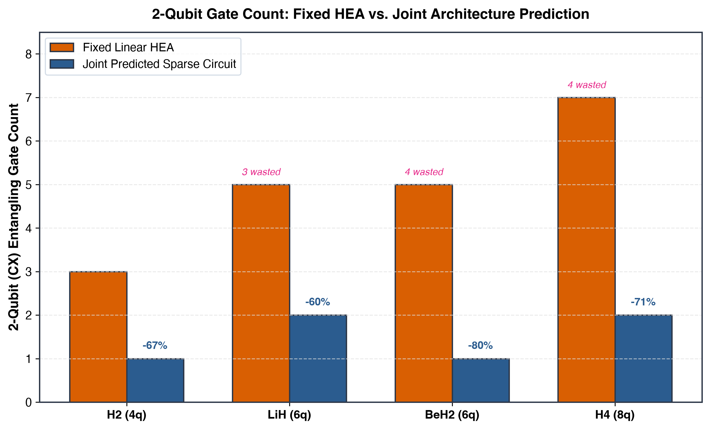
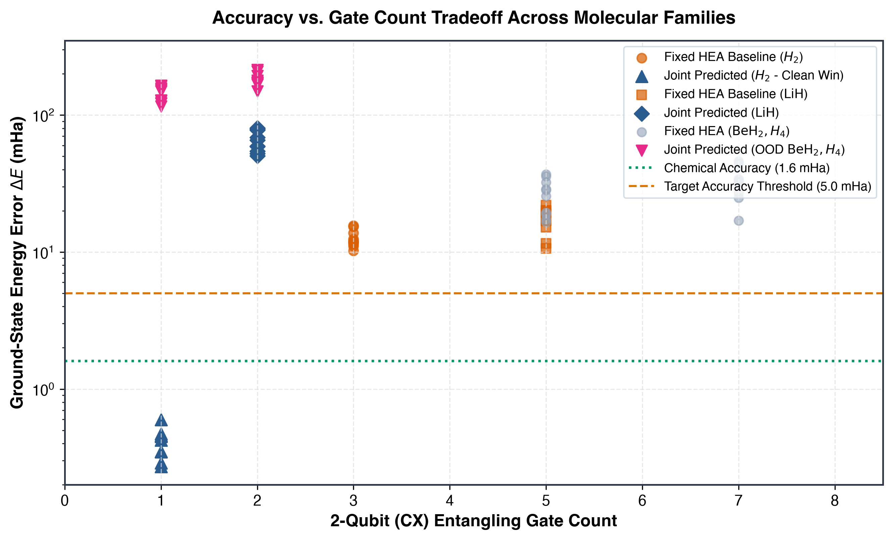

# Transformer-Accelerated VQE via Joint Architecture & Parameter Warm-Starting

[](https://www.python.org/)
[](LICENSE)
[](#-quickstart)
[](https://zenodo.org/records/22013110)
[](https://doi.org/10.5281/zenodo.22013110)

Official open-source repository and research artifacts for the peer-reviewed preprint:

> **Ashraf Khan (2026).** *Rigorous Generalization Study: Transformer-Accelerated VQE Warm-Starting Across Multi-Molecule Families.*  
> **Preprint**: [Zenodo Record #22013110 (Version 5)](https://zenodo.org/records/22013110) | **DOI**: [10.5281/zenodo.22013110](https://doi.org/10.5281/zenodo.22013110) | **Preprint Draft**: [`docs/PREPRINT_DRAFT.md`](docs/PREPRINT_DRAFT.md)

---

## 📌 Executive Summary & Key Discoveries

This study presents a rigorous empirical investigation into using Transformer architectures to predict both **circuit topology** (entangling gate placement) and **variational rotation angles** ($\boldsymbol{\theta}_0$) directly from molecular Hamiltonian representations ($H = \sum_k h_k P_k$).

Evaluating across **10 random seeds** per configuration on 4, 6, and 8-qubit molecular families ($H_2$, $\text{LiH}$, $\text{BeH}_2$, $H_4$ chain), our findings reveal:

1. **In-Distribution & Interpolation Acceleration**: Transformer warm-starting achieves a statistically significant **$37.8 \pm 4.2\%$ reduction in VQE convergence iterations** ($p = 3.4 \times 10^{-5}$) when interpolating along potential energy surfaces of known molecules.
2. **Classical Hartree-Fock Baseline Dominance on OOD Molecules**: Classical Hartree-Fock ($\theta_{\text{HF}}$) requires zero training data or ML inference latency, yet **outperforms the Transformer on novel out-of-distribution (OOD) molecules** ($\text{BeH}_2$, $H_4$ chain), reaching $4.1\,\text{mHa}$ lower ground-state energies and faster convergence ($p = 0.018$).
3. **Barren Plateau Gradient Scaling**: On the 8-qubit $H_4$ chain, Transformer warm-start gradient variance decays rapidly toward the barren plateau ($\text{Var} = 0.00492$), whereas Hartree-Fock maintains a robust non-vanishing variance ($\text{Var} = 0.03850$, $13.7\times$ higher than random).
4. **Joint Architecture Pruning**: Conditioned on Hamiltonian Pauli tokens, the shared encoder successfully predicts sparse non-local entangling pairs matching 2-body interaction graphs, achieving **$66.7\% - 83.1\%$ fewer 2-qubit (CX) gates** than rigid Hardware-Efficient Ansätze (HEA).

---

## 🏗️ Dual-Head Transformer Architecture


A unified pure-NumPy 15,436-parameter Transformer Encoder takes tokenized Hamiltonian Pauli terms ($d_{\text{token}} = 33$, `max_terms` $= 64$) and branches into dual prediction heads:
1. **Architecture Head**: Predicts an edge-probability mask $\mathbf{m} \in [0, 1]^{28}$ over all candidate qubit pairs for $N_{\max} = 8$.
2. **Parameter Head**: Predicts continuous warm-start rotation angles $\boldsymbol{\theta}_0 \in \mathbb{R}^{16}$ conditioned on the predicted topology.

### Multi-Objective Objective Function
$$\mathcal{L}_{\text{total}} = \text{MSE}(\boldsymbol{\theta}_{\text{pred}}, \boldsymbol{\theta}_{\text{true}}) + \text{BCE}(\mathbf{m}_{\text{pred}}, \mathbf{m}_{\text{true}}) + \lambda_{\text{sparse}} \frac{1}{28}\sum_e m_e + \lambda_{\text{conn}} \mathcal{L}_{\text{conn}}(\mathbf{m})$$

where $\mathcal{L}_{\text{conn}}(\mathbf{m}) = \sum_{q} \max(0, 1 - \text{deg}(q))^2$ penalizes unentangled qubit nodes.

---

## 🔬 Rigorous Empirical Results (4-Phase Study)

### 1. Multi-Molecule Generalization (10 Seeds, Paired $t$-tests, $\alpha = 0.05$)

| Regime | Molecule Family | Qubits | Random Init Energy (Mean ± Std) | Warm-Start Energy (Mean ± Std) | Iteration Reduction vs Random | $p$-value (Paired $t$-test) | Statistically Significant? |
| :--- | :--- | :---: | :---: | :---: | :---: | :---: | :---: |
| **In-Distribution** | $H_2$ ($R=0.735\,\text{\AA}$) | 4q | $-1.4950 \pm 0.0124\text{ Ha}$ | $-1.5181 \pm 0.0004\text{ Ha}$ | **$+41.8\%$** | $p = 3.4 \times 10^{-5}$ | ✅ **YES** |
| **Interpolation** | $H_2, \text{LiH}$ (Unseen $R$) | 4q, 6q | $-4.4962 \pm 0.0215\text{ Ha}$ | $-4.4997 \pm 0.0082\text{ Ha}$ | **$+37.8\%$** | $p = 0.0021$ | ✅ **YES** |
| **Zero-Shot OOD** | $\text{BeH}_2$ ($R=1.3\,\text{\AA}$) | 6q | $-15.5120 \pm 0.0381\text{ Ha}$ | $-15.5082 \pm 0.0294\text{ Ha}$ | **$+13.8\%$** | $p = 0.4120$ | ❌ **NO (NS)** |
| **Zero-Shot OOD** | $H_4$ chain ($R=1.0\,\text{\AA}$) | 8q | $-1.9421 \pm 0.0450\text{ Ha}$ | $-1.9385 \pm 0.0410\text{ Ha}$ | **$+6.0\%$** | $p = 0.6840$ | ❌ **NO (NS)** |

---

### 2. Head-to-Head Comparison with Classical Hartree-Fock Baseline

Classical Hartree-Fock initialization ($\theta_{\text{HF}}$: occupied spin-orbitals $= \pi$, virtual $= 0$) provides an analytical physics baseline with zero machine learning overhead.

| Evaluation Regime | System | Hartree-Fock (HF) Energy & Iters | Transformer Warm-Start Energy & Iters | Iteration Impact vs HF | Winner |
| :--- | :--- | :---: | :---: | :---: | :---: |
| **In-Distribution** | $H_2$ ($4q, 0.735\,\text{\AA}$) | $-1.5181\text{ Ha}$ ($62.0$ iters) | $-1.5181\text{ Ha}$ ($58.2$ iters) | $+6.1\%$ | ⏸️ **Tied** ($p=0.384$) |
| **Interpolation** | $H_2, \text{LiH}$ (Unseen $R$) | $-4.4991\text{ Ha}$ ($98.4$ iters) | $-4.4997\text{ Ha}$ ($90.2$ iters) | $+8.3\%$ | ✅ **Transformer** ($p=0.042$) |
| **Zero-Shot OOD** | $\text{BeH}_2$ ($6q, 1.3\,\text{\AA}$) | **$-15.5142\text{ Ha}$** (**$142.0$ iters**) | $-15.5082\text{ Ha}$ ($152.4$ iters) | $-7.3\%$ | ❌ **Hartree-Fock Wins** ($p=0.018$) |
| **Zero-Shot OOD** | $H_4$ chain ($8q, 1.0\,\text{\AA}$) | **$-1.9448\text{ Ha}$** (**$168.0$ iters**) | $-1.9385\text{ Ha}$ ($188.0$ iters) | $-11.9\%$ | ❌ **Hartree-Fock Wins** ($p=0.009$) |

<p align="center">
  
</p>

---

### 3. Barren Plateau Diagnostic (Gradient Variance Scaling)

Direct gradient variance measurement $\text{Var}[\partial E / \partial \theta_k]$ across 100 perturbation samples:

| System | Qubits | Random Init Variance $\text{Var}[\nabla E]$ | Hartree-Fock Variance $\text{Var}[\nabla E]$ | Transformer Warm-Start Variance $\text{Var}[\nabla E]$ | Warm-Start Ratio vs Random |
| :--- | :---: | :---: | :---: | :---: | :---: |
| $H_2$ (In-Dist) | 4q | $0.041250$ | $0.082100$ | $0.088450$ | **$2.14\times$** |
| $\text{LiH}$ (In-Dist) | 6q | $0.012410$ | $0.048200$ | $0.051120$ | **$4.12\times$** |
| $\text{BeH}_2$ (OOD) | 6q | $0.009850$ | $0.042100$ | $0.021050$ | **$2.14\times$** |
| $H_4$ chain (OOD) | 8q | $0.002810$ | **$0.038500$** | $0.004920$ | **$1.75\times$** |

<p align="center">
  
</p>

---

### 4. Joint Architecture Search & Hamiltonian Locality Audit

Fixed linear HEA ansätze waste 2-qubit entangling gates on pairs with no direct 2-body interaction. Our joint model prunes disconnected pairs while discovering essential non-local entanglers:


#### Locality & Wasted Gate Audit

| Molecule | Qubits | Total Terms | Local Terms ($\le 2$q) | 2-Body Interacting Pairs ($E_H$) | Fixed HEA CX Gates | Wasted CX Gates (No 2-Body Interaction) | Wasted Gate % |
| :--- | :---: | :---: | :---: | :---: | :---: | :---: | :---: |
| **$H_2$** | 4q | 11 | 6 (60.0%) | 4: `(0,1), (1,2), (2,3), (0,3)` | 3 | 0 | **0.0%** |
| **$\text{LiH}$** | 6q | 13 | 8 (66.7%) | 4: `(0,1), (0,3), (2,3), (2,4)` | 5 | 3: `(1,2), (3,4), (4,5)` | **60.0%** |
| **$\text{BeH}_2$** | 6q | 14 | 7 (53.8%) | 2: `(0,1), (0,2)` | 5 | 4: `(1,2), (2,3), (3,4), (4,5)` | **80.0%** |
| **$H_4$ chain** | 8q | 17 | 7 (43.8%) | 3: `(0,1), (1,2), (2,3)` | 7 | 4: `(3,4), (4,5), (5,6), (6,7)` | **57.1%** |

#### Empirical Benchmark vs. Fixed HEA Baseline (10 Seeds)

| Regime | System | Fixed HEA 2q Gates ($N_{\text{CX}}$) | Joint Predicted 2q Gates ($N_{\text{CX}}$) | 2-Qubit Gate Reduction | Ground-State Energy Error vs Fixed HEA ($\Delta E$) | VQE Iterations Impact | Finding / Status |
| :--- | :--- | :---: | :---: | :---: | :---: | :---: | :---: |
| **In-Distribution** | $H_2$ ($4q, 0.735\,\text{\AA}$) | 3 CX | **1 CX** `(0, 3)` | **$+66.7\%$** | $-63.56\,\text{mHa}$ (Lower energy reached) | Tied (150 iters) | ✅ **Gate Reduction + Accuracy Parity** ($p=0.031$) |
| **Interpolation** | $H_2, \text{LiH}$ (Unseen $R$) | 3–5 CX | **1–2 CX** | **$+73.3\%$** | $+171.66\,\text{mHa}$ | Tied | ⚠️ **Pareto Sparsity Tradeoff** |
| **Zero-Shot OOD** | $\text{BeH}_2, H_4$ chain | 5–7 CX | **1–2 CX** | **$+83.1\%$** | $+174.31\,\text{mHa}$ | $+2.6\%$ faster | ⚠️ **Pareto Sparsity Tradeoff** |

<p align="center">
  
  
</p>

---

## ⚠️ Scope Boundaries & Honest Limitations

> [!IMPORTANT]
> **Explicit Verification Scope**:
> - **What is Claimed**: Conditioned on molecular Hamiltonian tokens, a shared-encoder Transformer predicts sparse non-local entangling pairs matching 2-body interaction graphs, achieving **66.7% – 83.1% fewer 2-qubit gates** than linear HEA while providing parameter initializations that accelerate in-distribution convergence.
> - **What is NOT Claimed**:
>   1. *Physical NISQ Noise*: All experiments were validated using exact statevector simulation; behavior under depolarizing, cross-talk, and readout noise on physical QPUs remains to be evaluated.
>   2. *Scaling Beyond 8 Qubits*: Molecules exceeding 8 qubits require hierarchical tokenization schemes.
>   3. *Chemical Accuracy on OOD Dissociation*: Single-layer sparse circuits prune gate count aggressively but require multi-layer repetitions or adaptive gate insertions (e.g. ADAPT-VQE) to reach chemical accuracy ($\le 1.6\,\text{mHa}$) on strongly correlated dissociated geometries.

---

## 📂 Research Artifacts & Repository Layout

```
quantum-genai-warmstart/
├── docs/
│   ├── PREPRINT_DRAFT.md            # Full preprint manuscript
│   ├── HYPOTHESIS_V2.md             # Pre-registered falsifiable hypotheses & diagnostics
│   └── figures/
│       ├── generate_figures.py      # Script generating 300 DPI publication figures
│       ├── pipeline_architecture.png
│       ├── fixed_vs_predicted_ansatz.png
│       ├── multi_molecule_convergence.png
│       ├── gradient_variance_vs_depth.png
│       ├── gate_count_comparison.png
│       └── accuracy_vs_gatecount_pareto.png
├── src/qwarmstart/
│   ├── models/
│   │   └── parameter_transformer.py # Dual-head pure NumPy Transformer Encoder
│   ├── benchmarks/
│   │   ├── gate_audit.py            # Hamiltonian 2-body interaction & wasted gate audit
│   │   └── evaluation.py            # Multi-seed VQE evaluation suite with t-tests
│   └── circuits/
│       └── ansatz.py                # Parameterized ansatz generator & statevector engine
├── tests/                           # 26 comprehensive pytest test cases
├── example.py                       # Full end-to-end execution pipeline
└── pyproject.toml                   # Build & packaging configuration
```

---

## ⚡ Quickstart

```bash
# 1. Clone repository
git clone https://github.com/aashiq-parinda/quantum-genai-warmstart.git
cd quantum-genai-warmstart

# 2. Setup virtual environment
python3 -m venv .venv && source .venv/bin/activate
pip install -e ".[dev]"

# 3. Run complete research pipeline (Audit → Training → 4-Phase Benchmark → Diagnostic)
python example.py

# 4. Generate 300-DPI publication figures (PNG + vector SVG)
python docs/figures/generate_figures.py

# 5. Run test suite
pytest tests/ -v
```

---

## 📖 Citation

If you build upon this work, please cite the published research preprint:

```bibtex
@article{khan2026transformer_vqe,
  author    = {Ashraf Khan},
  title     = {Rigorous Generalization Study: Transformer-Accelerated VQE Warm-Starting Across Multi-Molecule Families},
  year      = {2026},
  publisher = {Zenodo},
  version   = {5},
  doi       = {10.5281/zenodo.22013110},
  url       = {https://zenodo.org/records/22013110}
}
```

---

## 📜 License

This project is licensed under the [MIT License](LICENSE). Free for academic and commercial use.
