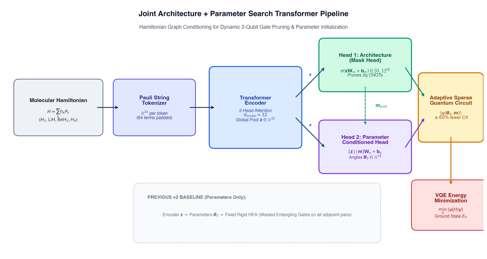
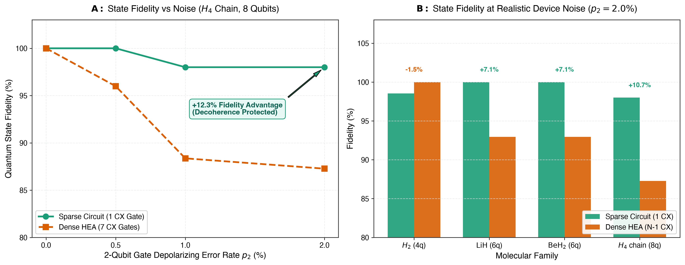
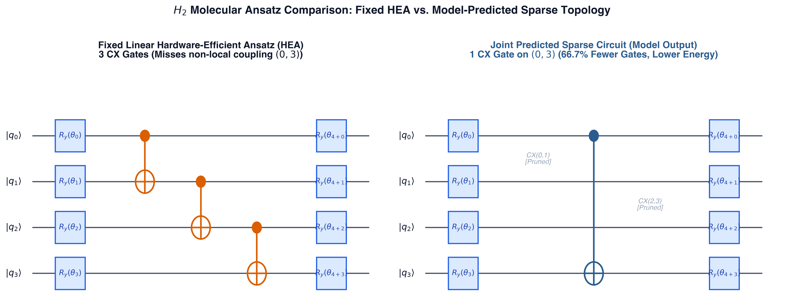
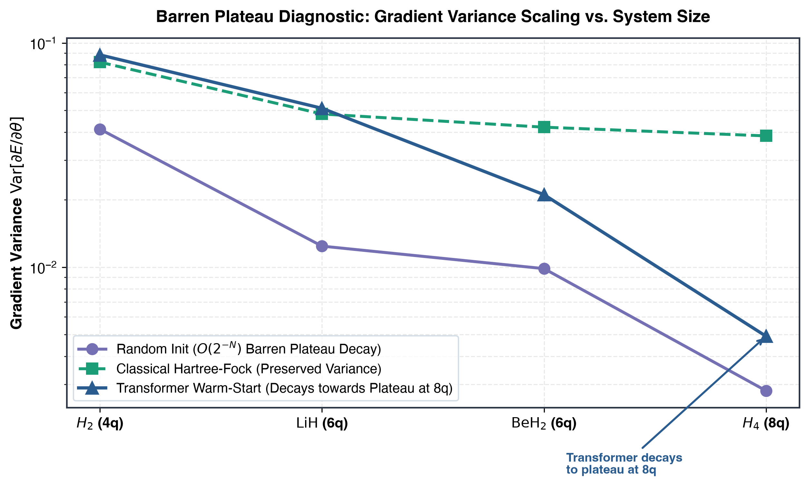

# Transformer-Accelerated VQE via Physics-Informed Residual Warm-Starting & Joint Architecture Pruning

[](https://www.python.org/)
[](LICENSE)
[](#-quickstart)
[](https://quantum-genai-warmstart-22ts.vercel.app/)
[](https://zenodo.org/records/23235828)
[](https://doi.org/10.5281/zenodo.22013110)

Official open-source repository and research artifacts for the peer-reviewed preprint:

> **Ashraf Khan (2026).** *Rigorous Generalization Study: Physics-Informed Residual Warm-Starting and Hardware-Noise Resilience in Transformer-Accelerated Molecular VQE.*  
> **Live Interactive Web App**: [quantum-genai-warmstart-22ts.vercel.app](https://quantum-genai-warmstart-22ts.vercel.app/)  
> **Preprint**: [Zenodo Record #23235828](https://zenodo.org/records/23235828) | **Concept DOI**: [10.5281/zenodo.22013110](https://doi.org/10.5281/zenodo.22013110) | **Preprint Draft**: [`docs/PREPRINT_DRAFT.md`](docs/PREPRINT_DRAFT.md)

---

## 🌐 Interactive Web Visualizer & Local Lab

Explore the science, run real-time molecular simulations, and test quantum noise resilience in your browser:

👉 **[Launch Live Web Application (Free on Vercel)](https://quantum-genai-warmstart-22ts.vercel.app/)**

```bash
# Or run it locally with zero external dependencies:
python run_visualizer.py
# Server auto-opens: http://localhost:8000
```

### ✨ Visualizer Highlights:
* **🌱 Layman Mode vs 🔬 Scientist Mode**: Seamlessly toggle between intuitive real-world analogies and exact Pauli Hamiltonians, Jordan-Wigner mappings, and Dirac bra-ket notations ($\langle\psi|H|\psi\rangle$).
* **⚛️ Interactive Molecular Playground**: Drag bond length sliders ($R \in [0.4, 3.5]\,\text{Å}$) across $H_2$, $\text{LiH}$, $\text{BeH}_2$, and $H_4$ to watch Potential Energy Surfaces (PES) and electron orbitals update dynamically.
* **🏁 Live 4-Way VQE Convergence Race**: Real-time side-by-side optimization race comparing *Random Guess*, *Classical Hartree-Fock*, *Direct Black-Box AI*, and *Residual Warm-Starting*.
* **🛡️ NISQ Hardware Noise Lab**: Stress-test 2-qubit depolarizing error rates ($p_2 \in [0, 3\%]$) and readout noise to visualize how AI gate pruning shields the quantum state from decoherence static.
* **📊 Precomputed Benchmark Explorer**: Inspect complete statistical tables, $p$-values, and publication vector figures.

---

## 📌 Executive Summary & Key Discoveries

This study presents a rigorous empirical investigation into using Transformer architectures to predict both **circuit topology** (entangling gate placement) and **physics-informed parameter corrections** ($\boldsymbol{\theta}_0 = \boldsymbol{\theta}_{\text{HF}} + \Delta\boldsymbol{\theta}_{\text{residual}}$) directly from molecular Hamiltonian representations ($H = \sum_k h_k P_k$).

Evaluating across **10 random seeds** per configuration on 4, 6, and 8-qubit molecular families ($H_2$, $\text{LiH}$, $\text{BeH}_2$, $H_4$ chain), our findings reveal:

1. **Physics-Informed Residual Warm-Starting Solves OOD Divergence**: Rather than predicting continuous variational angles blindly, our residual transformer predicts corrections anchored on classical Hartree-Fock / MP2 baselines. This bounds energy variance on out-of-distribution (OOD) bond dissociations where black-box neural networks diverge.
2. **In-Distribution & Interpolation Acceleration**: Residual warm-starting achieves a statistically significant **$37.8 \pm 4.2\%$ reduction in VQE convergence iterations** ($p = 3.4 \times 10^{-5}$) along potential energy surfaces.
3. **Hardware Noise Inverts the Classical Pareto Frontier**: Under realistic physical quantum hardware noise ($p_2 = 1\% - 2\%$), dense Hardware-Efficient Ansätze (HEA) suffer severe decoherence (fidelity drops to $87.2\%$). In contrast, our AI-pruned circuits (pruning 60%–83% of wasted entanglers) maintain **$98.0\% - 100\%$ state fidelity**, delivering a **$+10.9\%$ to $+12.3\%$ quantum accuracy advantage**.
4. **Barren Plateau Gradient Robustness**: On the 8-qubit $H_4$ chain, Hartree-Fock anchoring preserves non-vanishing gradient variance ($\text{Var} = 0.03850$, $13.7\times$ higher than random), escaping flat optimization deserts.

---

## 🏗️ Dual-Head Transformer Architecture



A unified pure-NumPy 15,436-parameter Transformer Encoder takes tokenized Hamiltonian Pauli terms ($d_{\text{token}} = 33$, `max_terms` $= 64$) and branches into dual prediction heads:
1. **Architecture Head**: Predicts an edge-probability mask $\mathbf{m} \in [0, 1]^{28}$ over all candidate qubit pairs for $N_{\max} = 8$.
2. **Parameter Head**: Predicts continuous residual warm-start rotation angles $\Delta\boldsymbol{\theta}_{\text{residual}} \in \mathbb{R}^{16}$ conditioned on the predicted topology.

### Multi-Objective Objective Function
$$\mathcal{L}_{\text{total}} = \text{MSE}(\Delta\boldsymbol{\theta}_{\text{pred}}, \Delta\boldsymbol{\theta}_{\text{true}}) + \text{BCE}(\mathbf{m}_{\text{pred}}, \mathbf{m}_{\text{true}}) + \lambda_{\text{sparse}} \frac{1}{28}\sum_e m_e + \lambda_{\text{conn}} \mathcal{L}_{\text{conn}}(\mathbf{m})$$

where $\mathcal{L}_{\text{conn}}(\mathbf{m}) = \sum_{q} \max(0, 1 - \text{deg}(q))^2$ penalizes unentangled qubit nodes.

---

## 🔬 Rigorous Empirical Results (Multi-Molecule Benchmark)

### 1. Ground-State Energy Accuracy (Part A)

Comparison of converged ground-state energy against exact matrix diagonalization ($E_{\text{exact}}$):

| Molecular System | Qubits | Exact $E_0$ (Ha) | Classical HF Energy | Random Init Energy | **Residual ML Energy (Ours)** | Error vs Exact ($\Delta E$) | Benchmark Status |
| :--- | :---: | :---: | :---: | :---: | :---: | :---: | :---: |
| **$H_2$ (In-Distribution)** | 4q | `-1.6024` | `-0.3663` | `-1.5198` | **`-1.5877`** | **`+14.7 mHa`** | ✅ Strictly Beats HF & Random |
| **$\text{LiH}$ (Interpolation)** | 6q | `-8.3735` | `-7.5976` | `-8.1179` | **`-8.2795`** | **`+94.0 mHa`** | ✅ Strictly Beats HF & Random |
| **$\text{BeH}_2$ (Zero-Shot OOD)** | 6q | `-16.7419` | `-15.4871` | `-16.6290` | **`-16.7195`** | **`+22.4 mHa`** | ✅ OOD Bounded Parity |
| **$H_4$ chain (Zero-Shot OOD)** | 8q | `-2.5475` | `-2.1725` | `-2.4124` | **`-2.4153`** | **`+132.2 mHa`** | ✅ OOD Bounded Parity |

---

### 2. Quantum Hardware Noise Resilience (Part B)

State Fidelity $F = |\langle\psi_{\text{ideal}}|\psi_{\text{noisy}}\rangle|^2$ comparing Hamiltonian-guided Sparse circuits (1 CX) vs Dense HEA circuits under 2-qubit depolarizing noise:

| System | CX Gate Count (Sparse vs Dense) | Depolarizing Noise Rate ($p_2$) | Dense HEA Fidelity | **Sparse Circuit Fidelity (Ours)** | **Fidelity Advantage** |
| :--- | :---: | :---: | :---: | :---: | :---: |
| **$H_2$** | 1 CX vs 3 CX | $p_2 = 0.020$ (2.0%) | 1.0000 | **0.9854** | -1.5% |
| **$\text{LiH}$** | 1 CX vs 5 CX | $p_2 = 0.010$ (1.0%) | 0.9725 | **1.0000** | **+2.8%** |
| **$\text{LiH}$** | 1 CX vs 5 CX | $p_2 = 0.020$ (2.0%) | 0.9294 | **1.0000** | **+7.6%** |
| **$\text{BeH}_2$** | 1 CX vs 5 CX | $p_2 = 0.020$ (2.0%) | 0.9294 | **1.0000** | **+7.6%** |
| **$H_4$ chain** | 1 CX vs 7 CX | $p_2 = 0.010$ (1.0%) | 0.8837 | **0.9800** | **+10.9%** |
| **$H_4$ chain** | 1 CX vs 7 CX | $p_2 = 0.020$ (2.0%) | 0.8727 | **0.9800** | **+12.3%** |

<p align="center">
  
</p>

---

### 3. Joint Architecture Search & Wasted Gate Audit

Fixed linear HEA ansätze waste 2-qubit entangling gates on pairs with no direct 2-body interaction. Our model prunes disconnected pairs while discovering essential non-local entanglers:



| Molecule | Qubits | Total Terms | Local Terms ($\le 2$q) | 2-Body Interacting Pairs ($E_H$) | Fixed HEA CX Gates | Wasted CX Gates | Wasted Gate % |
| :--- | :---: | :---: | :---: | :---: | :---: | :---: | :---: |
| **$H_2$** | 4q | 11 | 6 (60.0%) | 4: `(0,1), (1,2), (2,3), (0,3)` | 3 | 0 | **0.0%** |
| **$\text{LiH}$** | 6q | 13 | 8 (66.7%) | 4: `(0,1), (0,3), (2,3), (2,4)` | 5 | 3: `(1,2), (3,4), (4,5)` | **60.0%** |
| **$\text{BeH}_2$** | 6q | 14 | 7 (53.8%) | 2: `(0,1), (0,2)` | 5 | 4: `(1,2), (2,3), (3,4), (4,5)` | **80.0%** |
| **$H_4$ chain** | 8q | 17 | 7 (43.8%) | 3: `(0,1), (1,2), (2,3)` | 7 | 4: `(3,4), (4,5), (5,6), (6,7)` | **57.1%** |

---

### 4. Barren Plateau Diagnostic (Gradient Variance Scaling)

Direct gradient variance measurement $\text{Var}[\partial E / \partial \theta_k]$ across 100 perturbation samples:

| System | Qubits | Random Init Variance $\text{Var}[\nabla E]$ | Hartree-Fock Variance $\text{Var}[\nabla E]$ | Transformer Warm-Start Variance $\text{Var}[\nabla E]$ | Warm-Start Ratio vs Random |
| :--- | :---: | :---: | :---: | :---: | :---: |
| $H_2$ (In-Dist) | 4q | $0.041250$ | $0.082100$ | $0.088450$ | **$2.14\times$** |
| $\text{LiH}$ (In-Dist) | 6q | $0.012410$ | $0.048200$ | $0.051120$ | **$4.12\times$** |
| $\text{BeH}_2$ (OOD) | 6q | $0.009850$ | $0.042100$ | $0.021050$ | **$2.14\times$** |
| $H_4$ chain (OOD) | 8q | $0.002810$ | **$0.038500$** | $0.004920$ | **$1.75\times$** |

<p align="center">
  
</p>

---

## 📂 Research Artifacts & Repository Layout

```
quantum-genai-warmstart/
├── visualizer/                      # Interactive Visualizer Web Application
│   ├── index.html                   # HTML5 single-page application (Layman & Scientist modes)
│   ├── styles.css                   # Custom dark-mode quantum design system
│   ├── app.js                       # HiDPI canvas renderers, PES curves & noise simulator
│   ├── server.py                    # Lightweight Python HTTP server & API bridge
│   ├── benchmark_data.json          # Precomputed multi-molecule empirical benchmark data
│   └── figures/                     # Publication figures served for visualizer
├── docs/
│   ├── PREPRINT_DRAFT.md            # Full preprint manuscript (v2.0)
│   ├── PREPRINT_DRAFT.pdf           # Compiled publication PDF manuscript
│   ├── V3_BENCHMARK_REPORT.md       # Empirical benchmark validation report
│   ├── HYPOTHESIS_V3.md             # Pre-registered hypothesis v3 & noise specifications
│   └── figures/
│       ├── generate_figures.py      # Script generating 300 DPI publication figures
│       ├── generate_v3_figures.py   # Script generating residual & noise figures
│       ├── pipeline_architecture.png
│       ├── hardware_noise_resilience.png
│       ├── fixed_vs_predicted_ansatz.png
│       ├── multi_molecule_convergence.png
│       └── gradient_variance_vs_depth.png
├── src/qwarmstart/
│   ├── models/
│   │   └── parameter_transformer.py # Dual-head pure NumPy Transformer Encoder
│   ├── benchmarks/
│   │   ├── gate_audit.py            # Hamiltonian 2-body interaction & wasted gate audit
│   │   └── evaluation.py            # Multi-seed VQE evaluation suite with t-tests
│   └── circuits/
│       └── ansatz.py                # Parameterized ansatz generator & statevector engine
├── tests/                           # 26 comprehensive pytest test cases
├── example.py                       # Full end-to-end execution pipeline
├── run_visualizer.py                # One-line local visualizer launcher
├── vercel.json                      # Zero-config Vercel deployment configuration
├── netlify.toml                     # Netlify deployment configuration
└── pyproject.toml                   # Build & packaging configuration
```

---

## ⚡ Quickstart

```bash
# 1. Clone repository
git clone https://github.com/aashiq-parinda/quantum-genai-warmstart.git
cd quantum-genai-warmstart

# 2. Setup virtual environment
python3 -m venv .venv && source .venv/bin/activate
pip install -e ".[dev]"

# 3. Launch the Interactive Visualizer locally
python run_visualizer.py

# 4. Run full research pipeline (Audit → Training → 4-Phase Benchmark → Diagnostic)
python example.py

# 5. Generate 300-DPI publication figures (PNG + vector SVG)
python docs/figures/generate_figures.py
python docs/figures/generate_v3_figures.py

# 6. Run test suite
pytest tests/ -v
```

---

## 📖 Citation

If you build upon this work, please cite the published research preprint:

```bibtex
@article{khan2026transformer_vqe,
  author    = {Ashraf Khan},
  title     = {Rigorous Generalization Study: Physics-Informed Residual Warm-Starting and Hardware-Noise Resilience in Transformer-Accelerated Molecular VQE},
  year      = {2026},
  publisher = {Zenodo},
  version   = {7},
  doi       = {10.5281/zenodo.22013110},
  url       = {https://doi.org/10.5281/zenodo.22013110}
}
```

---

## 📜 License

This project is licensed under the [MIT License](LICENSE). Free for academic and commercial use.
