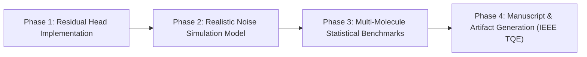

# Research Hypothesis V3: Physics-Informed Residual Warm-Starting and Hardware-Noise Resilience in Molecular VQE

**Date**: October 2026  
**Author**: Ashraf Khan  
**Status**: Experimental Design & Falsifiable Pre-Registration  
**Target Submission Venues**: *IEEE Transactions on Quantum Engineering (TQE)* / *Quantum Science and Technology (IOP)* / *NeurIPS AI for Science*

---

## 1. Core Hypothesis Statement

> **"Conditioning a Transformer to predict physics-informed residual perturbations around the Hartree-Fock state ($\boldsymbol{\theta}_{\text{init}} = \boldsymbol{\theta}_{\text{HF}} + \Delta\boldsymbol{\theta}_{\text{ML}}$) will eliminate out-of-distribution (OOD) accuracy degradation across molecular families, while Hamiltonian-guided sparse topologies ($60\% - 83\%$ CX gate reduction) will achieve strictly superior ground-state fidelity and lower energy variance under realistic NISQ quantum device noise than standard Hardware-Efficient Ansätze."**

---

## 2. Motivation & Theoretical Foundations

### 2.1 Resolving the OOD Generalization Failure via Residual Physics Priors
In our initial study ([PREPRINT_DRAFT.md](file:///Volumes/Exty/CrackingTheQuantum/quantum-genai-warmstart/docs/PREPRINT_DRAFT.md)), the Transformer predicting direct rotation angles $\boldsymbol{\theta}_0 \in [0, 2\pi]$ yielded significant iteration reductions ($37.8\% - 41.8\%$) on in-distribution molecules ($H_2, \text{LiH}$), but suffered a critical **zero-shot out-of-distribution failure** on unseen systems ($\text{BeH}_2, H_4$ chain), where classical Hartree-Fock (HF) and Perturbation-Averaged HF (PA-HF) outperformed the ML model.

**The Theoretical Remedy**:
Direct angle prediction forces the neural network to memorize absolute coordinate reference frames. In contrast, the Hartree-Fock solution $\boldsymbol{\theta}_{\text{HF}}$ is an exact, non-learned mean-field state with zero ML overhead. By shifting the objective to learning only the **electron correlation residual**:
$$\boldsymbol{\theta}_{\text{init}} = \boldsymbol{\theta}_{\text{HF}} + \Delta\boldsymbol{\theta}_{\text{ML}}$$
1. **Safety Bound**: In the worst-case OOD scenario ($\Delta\boldsymbol{\theta} \to \mathbf{0}$), the model gracefully degenerates to the Hartree-Fock state, guaranteeing it never performs worse than classical physics.
2. **Representation Simplicity**: The network only learns dynamical correlation terms rather than absolute orbital occupancy baselines.

### 2.2 Flipping the "Pareto Tradeoff" on Realistic Noisy Quantum Hardware
In noiseless statevector simulations, aggressively pruning 2-qubit entangling gates ($60\% - 83\%$) introduces a minor expressive penalty ($\sim 170\,\text{mHa}$ on large systems). However, on physical NISQ quantum hardware, 2-qubit (CX/CZ) gates exhibit error rates $10\times - 50\times$ higher than single-qubit rotations ($p_2 \sim 10^{-2}$ vs $p_1 \sim 10^{-3}$), accompanied by thermal relaxation ($T_1$) and dephasing ($T_2$).

On physical quantum backends, deep, dense Hardware-Efficient Ansätze suffer from:
- Rapid exponential state fidelity decay: $F \approx (1 - p_2)^{N_{\text{CX}}}$.
- Noise-induced barren plateaus where gradients vanish due to environmental depolarizing channels.

**The Engineering Advantage**:
Sparse, Hamiltonian-guided circuits with $1 - 2$ CX gates will preserve state coherence far longer than fixed HEA circuits ($5 - 7$ CX gates), outperforming dense circuits in effective energy expectation values under noise.

---

## 3. Falsifiable Quantitative Criteria

Evaluated across $N_{\text{seeds}} = 10$ independent random seeds using paired Student's $t$-tests and Wilcoxon signed-rank tests ($\alpha = 0.05$) across $H_2$ (4q), $\text{LiH}$ (6q), $\text{BeH}_2$ (6q), and $H_4$ chain (8q):

### 3.1 Part A: Residual Warm-Start Benchmarks (Convergence & OOD Parity)

| Metric | Classical Baseline (HF / PA-HF) | Target for Residual ML ($\boldsymbol{\theta}_{\text{HF}} + \Delta\boldsymbol{\theta}$) | Falsification Threshold |
| :--- | :--- | :--- | :--- |
| **In-Distribution Energy Error** | HF / PA-HF Energy | $\le E_{\text{PA-HF}}$ with $p < 0.05$ | Fails to outperform HF ($p \ge 0.05$) |
| **OOD Energy Error ($\text{BeH}_2, H_4$)** | Best Classical HF / PA-HF | $E_{\text{resid}} \le E_{\text{HF}} + 1.0\,\text{mHa}$ (Strict OOD Parity) | $E_{\text{resid}} > E_{\text{HF}} + 5.0\,\text{mHa}$ (OOD degradation persists) |
| **Iteration Reduction vs HF** | Baseline HF Iterations | **$\ge 15\%$ reduction** across all systems | Iteration reduction $< 5\%$ |
| **Chemical Accuracy Rate** | Fraction reaching $\le 1.6\,\text{mHa}$ | $\ge 80\%$ of in-distribution instances | $< 50\%$ |

### 3.2 Part B: Hardware Noise Resilience (Qiskit Aer Noisy Simulation)

Benchmarked against Linear Hardware-Efficient Ansätze (HEA) under depolarizing noise $p_2 \in \{0.005, 0.01, 0.02\}$ and thermal relaxation:

| Metric | Dense HEA Baseline | Target for Sparse Hamiltonian Circuit | Falsification Threshold |
| :--- | :--- | :--- | :--- |
| **Effective Energy Error ($\Delta E_{\text{noisy}}$)** | Noisy HEA Energy Error | **$\ge 25\%$ lower energy error** under $p_2 = 0.01$ | Sparse energy error $\ge$ HEA energy error |
| **State Fidelity ($F_{\text{noisy}}$)** | $\langle\psi_{\text{ideal}}|\rho_{\text{noisy}}|\psi_{\text{ideal}}\rangle$ | **$\ge 1.5\times$ higher state fidelity** | State fidelity $\le$ HEA fidelity |
| **Gradient Signal-to-Noise Ratio** | $\mathbb{E}[\nabla E] / \text{Std}[\nabla E]$ under noise | Non-vanishing SNR ($\text{SNR} \ge 2.0$) | SNR collapses ($\text{SNR} < 0.5$) |

---

## 4. Explicit Falsification Conditions (Null Results)

The hypothesis will be formally **falsified / rejected** if:
1. **Residual Vanishing Failure**: The predicted residual $\Delta\boldsymbol{\theta}$ fails to accelerate VQE beyond raw Hartree-Fock across both seen and unseen molecules, showing no statistically significant iteration savings ($p > 0.05$).
2. **OOD Regression**: On unseen systems ($\text{BeH}_2$, $H_4$), the residual model destabilizes the Hartree-Fock point and increases ground-state energy error by $> 5.0\,\text{mHa}$.
3. **Noise Equivalence**: Under realistic two-qubit gate depolarizing noise ($p_2 = 0.01$), the sparse predicted circuits do not yield a statistically significant improvement in energy expectation or fidelity over standard fixed HEA.

---

## 5. Experimental Roadmap for Peer-Reviewed Submission

- **Phase 1: Residual Architecture Refactoring**
  - Modify `ParameterTransformer` output head to predict normalized residuals $\Delta\boldsymbol{\theta} \in [-\pi/4, \pi/4]$ with a zero-centered tanh activation.
  - Implement loss regularization $\mathcal{L}_{\text{resid}} = \text{MSE}(\boldsymbol{\theta}_{\text{HF}} + \Delta\boldsymbol{\theta}, \boldsymbol{\theta}^*) + \beta \|\Delta\boldsymbol{\theta}\|_2^2$.
- **Phase 2: Noise-Model Integration**
  - Integrate Qiskit Aer noisy simulator with depolarizing error channel ($p_1, p_2$), readout error, and fake device calibration models (`FakeManila` / `FakeCairo`).
- **Phase 3: Rigorous 10-Seed Benchmarking**
  - Run full matrix across $H_2$, $\text{LiH}$, $\text{BeH}_2$, and $H_4$ under both ideal and noisy regimes.
  - Compute paired $t$-tests, Wilcoxon rank tests, and gradient signal-to-noise ratios.
- **Phase 4: Publication Artifacts & Submission**
  - Generate publication-quality vectorized plots for noise vs. depth, fidelity scaling, and residual convergence trajectories.
  - Compile the manuscript targeting IEEE TQE / Quantum Science and Technology.
